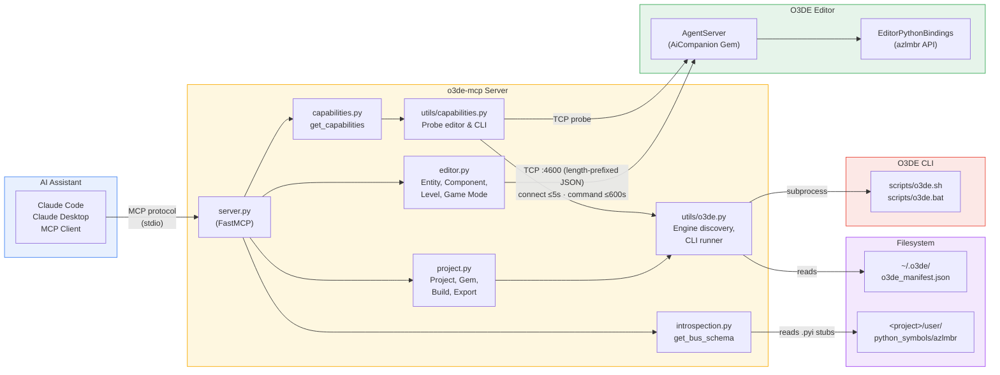

# Architecture

This document describes the high-level architecture of **o3de-mcp** — an MCP server that bridges AI assistants and the Open 3D Engine.

## Overview

o3de-mcp exposes O3DE capabilities through the [Model Context Protocol (MCP)](https://modelcontextprotocol.io), enabling AI assistants (Claude Code, Claude Desktop, or any MCP-compatible client) to automate the O3DE Editor and manage projects, gems, and builds.

Editor communication relies on the [**o3de-ai-companion-gem**](https://github.com/nickschuetz/o3de-ai-companion-gem) — an O3DE Gem that runs an AgentServer inside the editor, accepting Python script execution requests over a length-prefixed JSON protocol. The gem also bundles [**EditorPythonBindings**](https://docs.o3de.org/docs/api/gems/editorpythonbindings/index.html) support, giving scripts access to the full `azlmbr` API.

## Diagram



## Communication Paths

### Editor tools (real-time automation)

```
MCP Client → o3de-mcp → TCP :4600 → AiCompanion AgentServer → azlmbr API
```

The [**o3de-ai-companion-gem**](https://github.com/nickschuetz/o3de-ai-companion-gem) provides the AgentServer that listens on port 4600. o3de-mcp auto-detects the protocol on connection:

1. **AgentServer protocol** (preferred) — length-prefixed JSON framing with request/response semantics.
2. **Legacy RemoteConsole** (fallback) — raw text `pyRunScript` commands for older setups without the companion gem.

Scripts are base64-encoded for safe transport and executed in the editor's embedded Python interpreter.

#### Connection lifecycle & timeouts

A single persistent TCP connection is pooled across tool calls (`_EditorConnectionPool`). Each `send_script` runs in two bounded phases:

1. **Connect** — bounded by `O3DE_EDITOR_CONNECT_TIMEOUT` (default **5s**). On first use the pool opens the socket and detects the protocol by sending a framed `ping`; if that fails it transparently reconnects for the legacy text protocol.
2. **Command** — bounded by `O3DE_EDITOR_TIMEOUT` (default **600s**). The editor executes the submitted script *synchronously* and does not reply until it finishes, so this timeout is effectively "how long an editor operation may take." Level loads, game-mode entry, and on-demand asset compilation routinely exceed tens of seconds, so the default is deliberately generous; `run_editor_python` also accepts a per-call `timeout` override.

Separating the two means an **unreachable** editor still fails in milliseconds (connect timeout + a 5s fast-fail window that short-circuits repeated attempts) even when a long command timeout is configured. A command that times out returns a `timeout` error noting the editor may still be running the script — retrying blindly can duplicate work, so prefer raising the timeout.

### Project tools (CLI-based)

```
MCP Client → o3de-mcp → subprocess → scripts/o3de.sh (or .bat) → O3DE CLI
```

No running editor required. Engine discovery reads `~/.o3de/o3de_manifest.json` and supports multiple registered engines via `O3DE_ENGINE_NAME`.

### Capability detection

```
MCP Client → get_capabilities() → TCP probe + CLI probe → aggregated report
```

Always call `get_capabilities()` first to determine which tool categories are available before invoking other tools.

## Module Responsibilities

| Module | Role |
|--------|------|
| `server.py` | FastMCP entry point — registers all tool modules |
| `tools/capabilities.py` | Exposes `get_capabilities` tool |
| `tools/editor.py` | 16 editor automation tools — entity CRUD, components, levels, game mode; pooled TCP transport with protocol auto-detection |
| `tools/introspection.py` | Exposes `get_bus_schema` — gem-agnostic EBus discovery from the editor's generated `azlmbr` stubs |
| `tools/project.py` | 12 project management tools — create, build, export, gem management |
| `utils/capabilities.py` | Runtime probing logic (TCP connect check, CLI availability) |
| `utils/introspection.py` | Parses `<project>/user/python_symbols/azlmbr/*.pyi` stubs into a structured EBus schema |
| `utils/o3de.py` | Engine/manifest discovery, CLI runner, project/gem listing |

## Related Projects

- [**o3de-ai-companion-gem**](https://github.com/nickschuetz/o3de-ai-companion-gem) — The O3DE Gem that enables editor-side communication. Provides the AgentServer that o3de-mcp connects to for real-time editor automation. Must be enabled in your O3DE project alongside [EditorPythonBindings](https://docs.o3de.org/docs/api/gems/editorpythonbindings/index.html) for editor tools to work.
- [**O3DE (Open 3D Engine)**](https://github.com/o3de/o3de) — The game engine itself.
